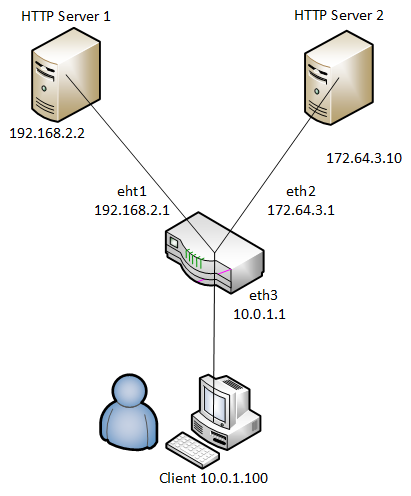
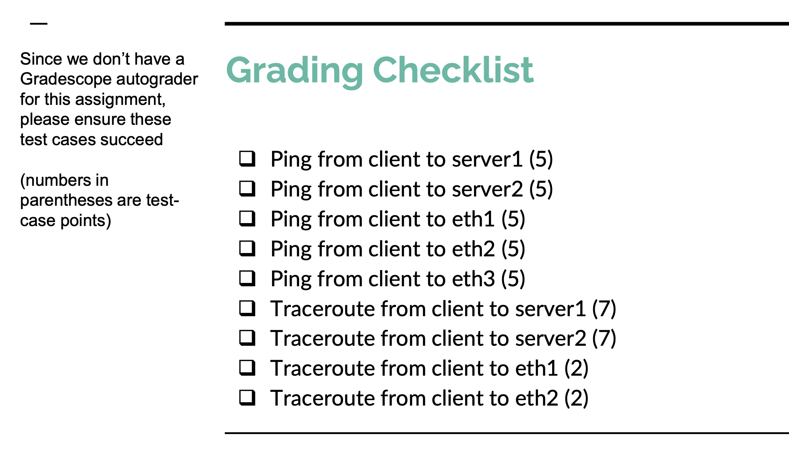
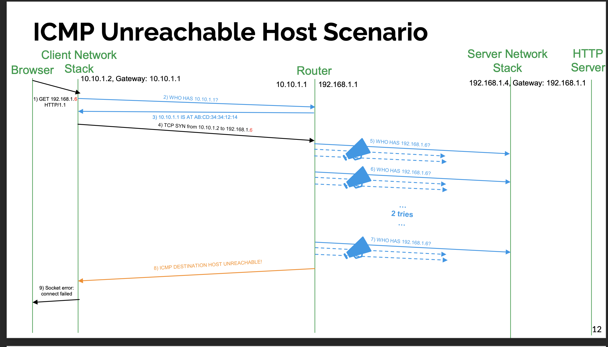
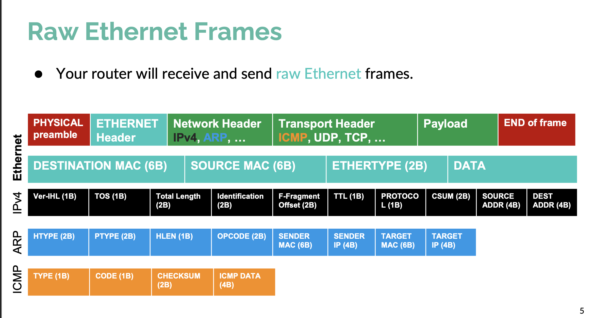

### Configuration Files
There are two configuration files for the router.
- ```src/IP_CONFIG```: Lists out the IP addresses assigned to the emulated hosts.
- ```src/router/rtable```: The static routing table used for the simple router.


---
## Running the Emulation
First, start the POX controller:
```
$ cd assignments-spring24/Assignment2/src
$ ./run_pox.sh
```
```
$ cd assignments-spring24/Assignment2/src
$ ./run_mininet.sh
```
```
$ cd assignments-spring24/Assignment2/src
$ ./sr_solution_macm
```

一些笔记:
- cd Desktop/CN/Assignment2
- multipass launch focal -n cn-a2 --cloud-init config.yaml
- multipass shell cn-a2
- lsof -i TCP:8888 | grep LISTEN
- con+D : POX, MININET
- con+C : ./sr
- Just run MININET
- Kill again
- Run order 1pox 2mininet 3sr.
- To stop Mininet and POX, run ./kill_all.sh in a normal terminal in the VM.
**TIP:** To stop the router program, use ```Ctrl-C``` as you would with a normal C program. To stop Mininet and POX, run ```./kill_all.sh``` in a normal terminal in the VM.

---
### Test
- Ping from the client to any of the router’s interfaces (192.168.2.1, 172.64.3.1, 10.0.1.1).
  - client ping -c 3 192.168.2.1
  - client ping -c 3 172.64.3.1
  - client ping -c 3 10.0.1.100
- Ping from the client to any of the app servers (192.168.2.2, 172.64.3.10)
  - client ping -c 3 192.168.2.2
  - client ping -c 3 172.64.3.10
- Traceroute from the client to any of the router’s interfaces
  - client traceroute -n 192.168.2.1
  - client traceroute -n 172.64.3.1
  - client traceroute -n 10.0.1.100
- Traceroute from the client to any of the app servers
  - client traceroute -n 192.168.2.2
  - client traceroute -n 172.64.3.10
  
- Downloading a file using HTTP from one of the app servers
  - client wget http://192.168.2.2
  - client wget http://172.64.3.10
  

  - client ping -c 3 -t 1 192.168.2.2
  - client ping -c 3 10.0.4.4
  - client ping -c 3 192.64.8.8

  client ping client
  
  
  mininet> client ping -c 3 192.168.1.5
PING 192.168.1.5 (192.168.1.5) 56(84) bytes of data.
From 10.0.1.1 icmp_seq=1 Destination Net Unreachable
From 10.0.1.1 icmp_seq=2 Destination Net Unreachable
From 10.0.1.1 icmp_seq=3 Destination Net Unreachable

**~~~**
修改ReadMe.
send a ping from client to destination IP not in routing table(router should reject with "destination Net Unreachable")
send a ping from client to destination IP in routing table but does not exist (router return destination host unreachable)
**~~~**

  
  


---
## Starter Code

You should now have all the pieces needed to build and run the router. You can build and run the starter code as follows:
```
$ cd assignments-spring24/Assignment2/src/router
$ make
$ ./sr
```

---
## Protocols
### Ethernet
Your router is given a raw Ethernet frame and your router must send raw Ethernet frames. The headers contain source and destination MAC addresses, and to forward a packet one hop, we must change the destination MAC address of the forwarded packet to the MAC address of the next hop’s incoming interface.

### Internet Protocol (IP)
Before operating on an IP packet, you should verify its checksum and make sure it meets the minimum length of an IP packet. You should understand how to find the longest prefix match of a destination IP address in the routing table. If you determine that a datagram should be forwarded, you should correctly decrement the TTL field of the header and recompute the checksum over the changed header before forwarding it to the next hop.

#### IP Forwarding Logic
Given a raw Ethernet frame, if the frame contains an IP packet that is not destined for one of our interfaces:

- Sanity-check the packet: check that it meets minimum length and has the correct checksum.
- Decrement the TTL by 1 and recompute the packet checksum over the modified header.
  - If TTL is expired, send an ICMP time exceeded (type 11) message.
- Find out which entry in the routing table has the longest prefix match with the destination IP address.
- Check the ARP cache for the next-hop MAC address corresponding to the next-hop IP.
  - If ARP entry is there, forward the IP packet.
  - Otherwise, send an ARP request for the next-hop IP (if one hasn’t been sent within the last second), and add the packet to the queue of packets waiting on this ARP request.

If an error occurs in any of the above steps, you will have to send an ICMP message back to the sender notifying them of an error.

#### IP Packet Destinations
An incoming IP packet may be destined for one of your router’s IP addresses, or it may be destined elsewhere. If it is sent to one of your router’s IP addresses, you should take the following actions:

- If the packet is an ICMP echo request (type 8) and its checksum is valid, send an ICMP echo reply (type 0) to the sending host.
- If the packet contains a TCP or UDP payload, send an ICMP port unreachable (type 3, code 3) to the sending host. Otherwise, ignore the packet.
- Packets destined elsewhere should be forwarded using the forwarding logic above.

### Internet Control Message Protocol (ICMP)
ICMP is a simple protocol that can send control information to a host. In this assignment, your router will use ICMP to send messages back to the sending host. You will need to properly generate the following ICMP messages (including the ICMP header checksum) in response to the sending host under the following conditions:

- **Echo reply (type 0)**

  Sent in response to an echo request (ICMP type 8) to one of the router’s interfaces. This is only for echo requests to one of our interfaces (to any of the router’s known IPs). This is needed for ping to work. An echo request sent elsewhere (e.g. not to one of our interfaces) should be forwarded to the next hop address as usual.

- **Destination net unreachable (type 3, code 0)**

  Sent if there is a non-existent route to the destination IP (no matching entry in routing table when forwarding an IP packet).

- **Destination host unreachable (type 3, code 1)**

  Sent if five ARP requests were sent to the next-hop IP without a response.

- **Port unreachable (type 3, code 3)**

  Sent if an IP packet containing a UDP or TCP payload is sent to one of the router’s interfaces. This is needed for traceroute to work.

- **Time exceeded (type 11, code 0)**

  Sent if an IP packet is discarded during processing because the TTL field is 0. This is also needed for traceroute to work.

The source address of an ICMP message can be the source address of any of the incoming interfaces, as specified in [RFC 792](https://tools.ietf.org/html/rfc792). As mentioned above, the only incoming ICMP messages destined towards the router’s IPs that you have to explicitly process are ICMP echo requests (type 8).

<!-- You may want to create additional structs for ICMP messages for convenience, but make sure to use the packed attribute so that the compiler doesn’t try to align the fields in the struct to word boundaries. -->

### Address Resolution Protocol (ARP)
ARP is needed to determine the next-hop MAC address that corresponds to the next-hop IP address stored in the routing table. Without the ability to generate an ARP request and process ARP replies, your router would not be able to fill out the destination MAC address field of the raw Ethernet frame you are sending over the outgoing interface. Analogously, without the ability to process ARP requests and generate ARP replies, no other router could send your router Ethernet frames. Therefore, your router must generate and process ARP requests and replies.

To lessen the number of ARP requests sent out, you are required to cache ARP replies. Cache entries should time out after 15 seconds to minimize staleness. The provided ARP cache class already times the entries out for you. When forwarding a packet to a next-hop IP address, the router should first check the ARP cache for the corresponding MAC address before sending an ARP request. In the case of a cache miss, an ARP request should be sent to a target IP address about once every second until a reply comes in. If the ARP request is sent five times with no reply, an ICMP destination host unreachable is sent back to the source IP as stated above. The provided ARP request queue will help you manage the request queue.

In the case of an ARP request, you should only send an ARP reply if the target IP address is one of your router’s IP addresses. In the case of an ARP reply, you should only cache the entry if the target IP address is one of your router’s IP addresses.

Note that ARP requests are sent to the broadcast MAC address (```ff-ff-ff-ff-ff-ff```). ARP replies are sent directly to the requester’s MAC address.

---
## Code Overview

Your router receives a raw Ethernet frame and sends raw Ethernet frames when sending a reply to the sending host or forwarding the frame to the next hop. The basic functions to handle these functions are:

```
void sr_handlepacket(struct sr_instance* sr, uint8_t * packet, unsigned int len, char* interface)
```
This method, located in ```sr_router.c```, is called by the router each time a packet is received. The “packet” argument points to the packet buffer which contains the full packet including the ethernet header. The name of the receiving interface is passed into the method as well.

```
int sr_send_packet(struct sr_instance* sr, uint8_t* buf, unsigned int len, const char* iface)
```

This method, located in ```sr_vns_comm.c```, will send an arbitrary packet of length, len, to the network out of the interface specified by iface.

You should not free the buffer given to you in sr_handlepacket (this is why the buffer is labeled as being “lent” to you in the comments). You are responsible for doing correct memory management on the buffers that sr_send_packet borrows from you (that is, sr_send_packet will not call free on the buffers that you pass it).

```
void sr_arpcache_sweepreqs(struct sr_instance *sr)
```
The assignment requires you to send an ARP request about once a second until a reply comes back or we have sent five requests. This function is defined in ```sr_arpcache.c``` and called every second, and you should add code that iterates through the ARP request queue and re-sends any outstanding ARP requests that haven’t been sent in the past second. If an ARP request has been sent 5 times with no response, a destination host unreachable should go back to all the sender of packets that were waiting on a reply to this ARP request.


---
## Debugging Functions
There are some basic debugging functions in ```sr_utils.h```, ```sr_utils.c```. Feel free to use them to print out network header information from your packets. Below are some functions you may find useful:

- ```print_hdrs(uint8_t *buf, uint32_t length)``` Prints out all possible headers starting from the Ethernet header in the packet
- ```print_addr_ip_int(uint32_t ip)```Prints out a formatted IP address from a uint32_t. Make sure you are passing the IP address in the correct byte ordering.

 
## Requirements Summary
Please checkout the tutorial slides for a complete checklist of what we test for this assignment. In summary:
- The router must successfully route packets between the Internet and the application servers.
- The router must correctly handle ARP requests and replies.
- The router must respond correctly to ICMP echo requests (ping commands).
- The router must correctly handle traceroutes through it (where it is not the end host) and to it (where it is the end host).
- The router must handle TCP/UDP packets sent to one of its interfaces. In this case, the router should respond with an ICMP port unreachable (type 3, code 3).
- The router must maintain an ARP cache whose entries are invalidated after a timeout period (15 seconds).
- The router must queue all packets waiting for outstanding ARP replies. If a host does not respond to 5 ARP requests, the queued packet is dropped and an ICMP host unreachable message (type 3, code 1) is sent back to the source of the queued packet.
- The router must enforce guarantees on timeouts - that is, if an ARP request is not responded to within a fixed period of time, the ICMP host unreachable message (echo 3, code 1) is generated even if no more packets arrive at the router. (Note: You can guarantee this by implementing the ```sr_arpcache_sweepreqs()``` function in ```sr_arpcache.c``` correctly.)
- The router must not needlessly drop packets (for example, when waiting for an ARP reply)

---
## Testing Your Code
Due to the complexities of the Mininet setup, we will not be able to autograde this assignment using Gradescope. Instead, we will download your code and test it ourselves. To test your own code, you should perform the ping/traceroute/wget commands on your ```./sr``` binary as detailed above in [Running the Emulation](#running-the-emulation). These are the "public" tests and will be worth a significant portion of the grade.

In addition to your router being able to perform these commands, make sure that you are sending the appropriate ICMP messages under different types of "error" cases, as detailed in the [ICMP](#internet-control-message-protocol-icmp) section and the [Requirements Summary](#requirements-summary).

---
## Submission Instructions

You will be required to submit a ```README.md``` along with your code for this assignment. In your README, please describe your design decisions. We have provided a ```README.md``` skeleton in the ```/src/router``` folder. The ```README``` will be worth 10% of the assignment grade.

Zip up the files in your ```assignments-spring24/Assignment2/src/router``` folder by running the following command:

```
$ make clean
$ zip -9r router-JHED.zip Makefile README.md rtable auth_key *.h *.c
```
Replace JHED with your JHED ID. Submit the zip file to Gradescope.

zip -9r router-xxx.zip Makefile README.md rtable auth_key *.h *.c

Your Submission will be graded immediately after the submission deadline. Late submissions will be graded after the late submission deadline.






